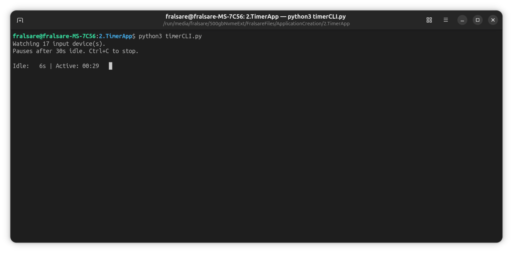

# Timer CLI Application

Timer CLI is a lightweight command-line utility designed for Linux systems that tracks the amount of active usage time versus idle time. It automatically pauses the active timer when no keyboard, mouse, or touch input is detected for a configurable duration.

## 🖼️ Demo

Here is a screenshot demonstrating the application in action:


## Installation

### Prerequisites

*   A Linux operating system (The input monitoring mechanism relies on Linux kernel features).
*   Python 3.x

### Setup Steps

1.  **Clone the Repository:**
    ```bash
    git clone <repository-url>
    cd timer-cli
    ```
2.  **Install Dependencies (None required for this specific version, but good practice):**
    *This script only uses standard Python libraries.*
3.  **Grant Permissions (Crucial Step!):**
    Since the application needs to read input device events, your user account must have read access to `/dev/input/event*`. This is typically achieved by adding your user to the `input` group.

    **Run this command in your terminal:**
    ```bash
    sudo usermod -aG input $USER
    ```
    **⚠️ IMPORTANT:** After running this command, you must **log out and log back in** (or reboot) for the group change to take effect.

## Usage

### Running the Timer

After completing the setup and logging back in, you can run the application from your terminal:

```bash
python3 timerCLI.py
```

The application will start monitoring your input devices.

*   **Idle Period:** When no input is detected for the configured `IDLE_LIMIT` (default: 30 seconds), the timer will automatically pause.
*   **Resumption:** The timer will resume as soon as any input event is detected.
*   **Stopping:** Press `Ctrl+C` to stop the application and view the final usage statistics.

---

## 📜 License

This project is licensed under the [MIT License](LICENSE). See the `LICENSE` file for the full license text.

<details>
<summary>MIT License (summary)</summary>

You are free to use, copy, modify, merge, publish, distribute, sublicense, and/or sell copies of this software. The only requirement is that you include the original copyright notice and this permission notice in all copies or substantial portions of the software.

Copyright (c) 2026 fralsare
</details>

*This application is designed to be a learning project and relies on specific Linux kernel interfaces.*
